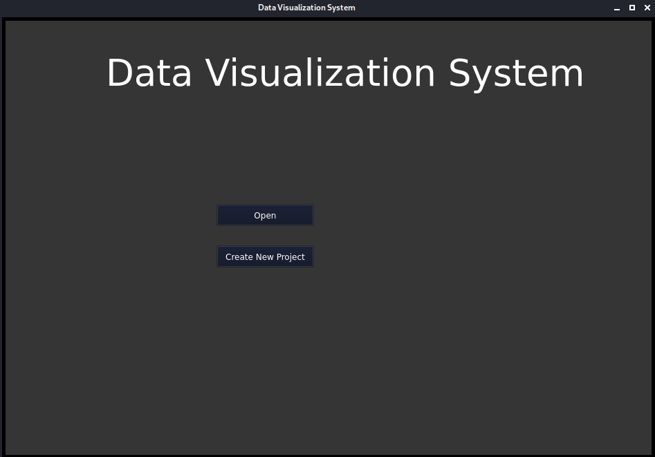
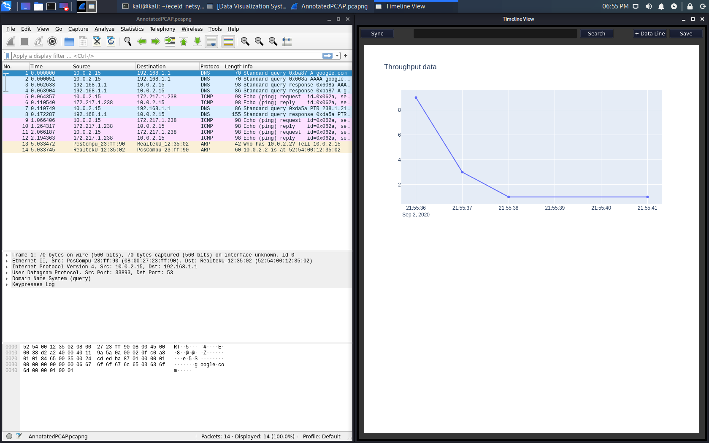
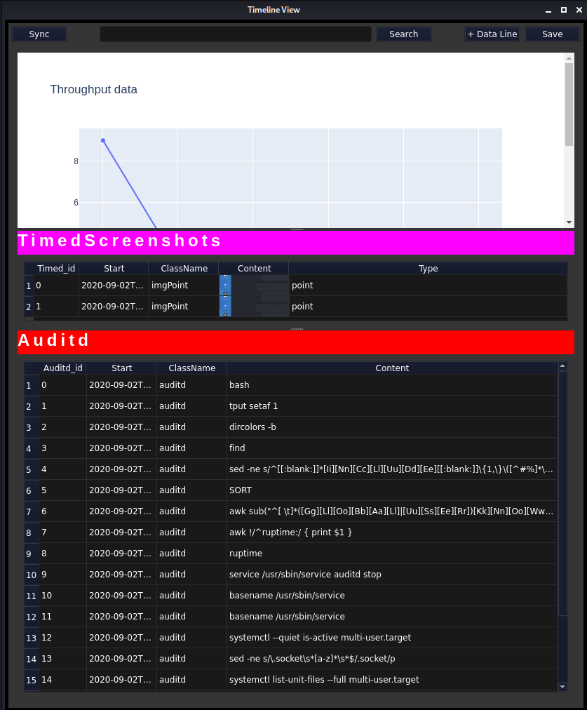
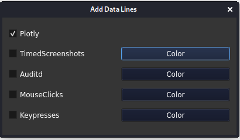

##Linux Walkthrough
###Command to run the GUI
`sudo python3 -m GUI.InitialWindow.py --no-sandbox'

###File Menu

Uses system's file manager for selection

###Starting Screen

Once the project has been created/selected. eceld-wireshark and the timeline view
will automatically open to display system information. The datalines will
have to be opened manually, but from the beginning the user can select packages
from the throughput timeline which will also be selected in eceld-wireshark. 

Once datalines have been added the user will be able to manipulate the size of each
dataline, as well as size of the table rows and columns. The content of each 
dataline can also be right clicked to show what possible actions can be performed 
on the data. Any edited information will be saved in OGData in the ParsedLogs folder
of the project. 

###Adding a Dataline

To add a dataline people can choose which datalines they want displayed by using checkboxes.

